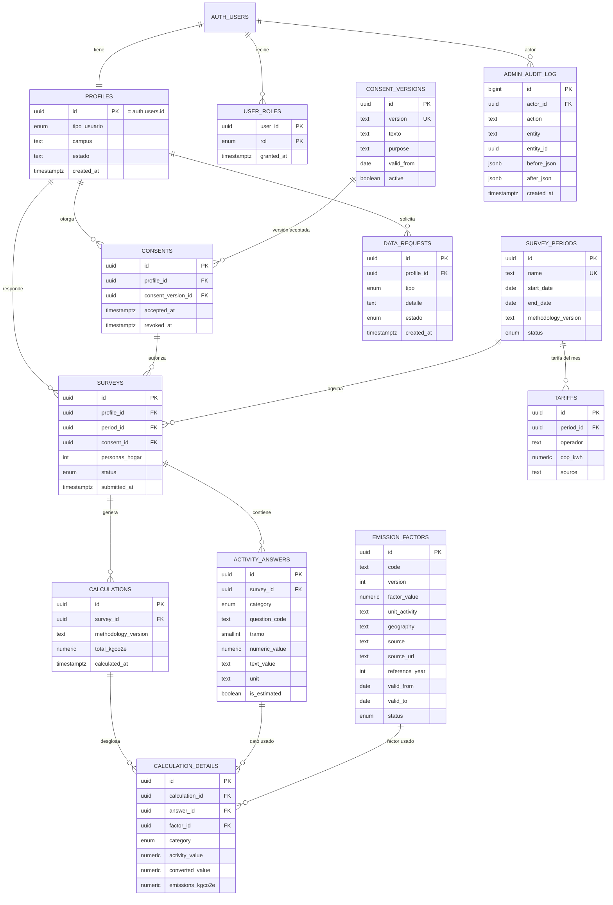

# Diagrama entidad-relación · HuellaViva UAN

GitHub muestra este bloque como diagrama.

```mermaid
erDiagram
  AUTH_USERS ||--|| PROFILES : "tiene"
  AUTH_USERS ||--o{ USER_ROLES : "recibe"
  PROFILES ||--o{ CONSENTS : "otorga"
  CONSENT_VERSIONS ||--o{ CONSENTS : "versión aceptada"
  PROFILES ||--o{ SURVEYS : "responde"
  CONSENTS ||--o{ SURVEYS : "autoriza"
  SURVEY_PERIODS ||--o{ SURVEYS : "agrupa"
  SURVEY_PERIODS ||--o{ TARIFFS : "tarifa del mes"
  SURVEYS ||--o{ ACTIVITY_ANSWERS : "contiene"
  SURVEYS ||--o{ CALCULATIONS : "genera"
  CALCULATIONS ||--o{ CALCULATION_DETAILS : "desglosa"
  ACTIVITY_ANSWERS ||--o{ CALCULATION_DETAILS : "dato usado"
  EMISSION_FACTORS ||--o{ CALCULATION_DETAILS : "factor usado"
  PROFILES ||--o{ DATA_REQUESTS : "solicita"
  AUTH_USERS ||--o{ ADMIN_AUDIT_LOG : "actor"

  PROFILES {
    uuid id PK "= auth.users.id"
    enum tipo_usuario
    text campus
    text estado
    timestamptz created_at
  }
  USER_ROLES {
    uuid user_id PK
    enum rol PK
    timestamptz granted_at
  }
  CONSENT_VERSIONS {
    uuid id PK
    text version UK
    text texto
    text purpose
    date valid_from
    boolean active
  }
  CONSENTS {
    uuid id PK
    uuid profile_id FK
    uuid consent_version_id FK
    timestamptz accepted_at
    timestamptz revoked_at
  }
  SURVEY_PERIODS {
    uuid id PK
    text name UK
    date start_date
    date end_date
    text methodology_version
    enum status
  }
  SURVEYS {
    uuid id PK
    uuid profile_id FK
    uuid period_id FK
    uuid consent_id FK
    int personas_hogar
    enum status
    timestamptz submitted_at
  }
  ACTIVITY_ANSWERS {
    uuid id PK
    uuid survey_id FK
    enum category
    text question_code
    smallint tramo
    numeric numeric_value
    text text_value
    text unit
    boolean is_estimated
  }
  EMISSION_FACTORS {
    uuid id PK
    text code
    int version
    numeric factor_value
    text unit_activity
    text geography
    text source
    text source_url
    int reference_year
    date valid_from
    date valid_to
    enum status
  }
  TARIFFS {
    uuid id PK
    uuid period_id FK
    text operador
    numeric cop_kwh
    text source
  }
  CALCULATIONS {
    uuid id PK
    uuid survey_id FK
    text methodology_version
    numeric total_kgco2e
    timestamptz calculated_at
  }
  CALCULATION_DETAILS {
    uuid id PK
    uuid calculation_id FK
    uuid answer_id FK
    uuid factor_id FK
    enum category
    numeric activity_value
    numeric converted_value
    numeric emissions_kgco2e
  }
  DATA_REQUESTS {
    uuid id PK
    uuid profile_id FK
    enum tipo
    text detalle
    enum estado
    timestamptz created_at
  }
  ADMIN_AUDIT_LOG {
    bigint id PK
    uuid actor_id FK
    text action
    text entity
    uuid entity_id
    jsonb before_json
    jsonb after_json
    timestamptz created_at
  }
```
